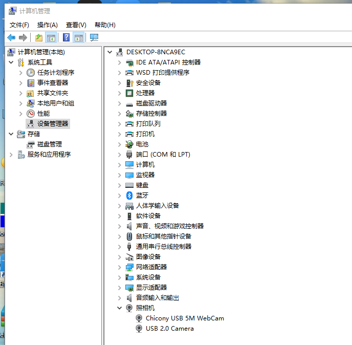

# GstTool
a tool of gst

## How to use

###  Server End

stream a usb camera to your pc:
```shell
gst-launch-1.0 ksvideosrc device-name="设备列表中的相机设备名" ! videoconvert ! videoscale ! \ 
video/x-raw,format=I420,width=1280,height=720,framerate=30/1 ! videoconvert ! \ 
x264enc name=videoEnc bitrate=2000 tune=zerolatency pass=qual ! rtph264pay \
! udpsink host=目标IP port=指定端口 sync=false -v
```

How to find your device-name:

Take windows as an example:


Now the "USB 2.0 Camera" is my device-name of personal camera. So I can run the following command on my pc:

```shell
gst-launch-1.0 ksvideosrc device-name="USB 2.0 Camera" ! videoconvert ! videoscale ! \
video/x-raw,format=I420,width=1280,height=720,framerate=30/1 ! videoconvert ! \
x264enc name=videoEnc bitrate=10000 tune=zerolatency pass=qual ! rtph264pay ! \
udpsink host=192.168.5.152 port=5004 sync=false async=false
```

### User End

Run the GstTool and you can see camera stream.